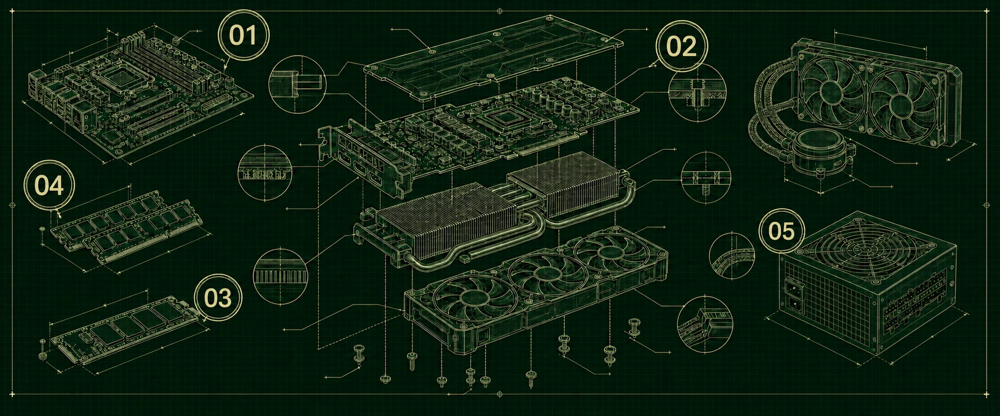
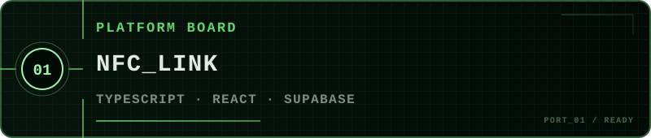
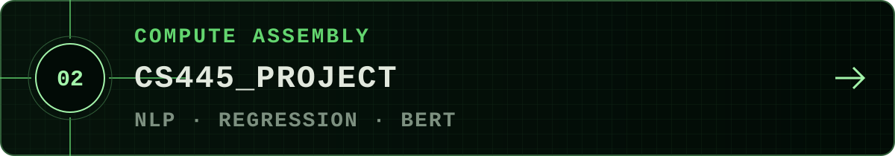
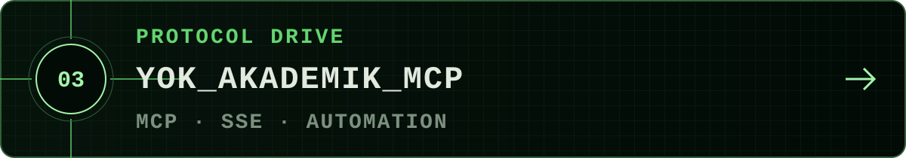
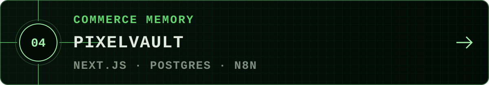
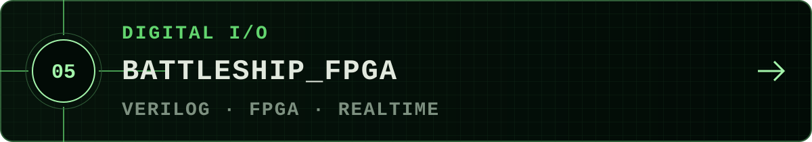

  
<samp>UÇ/GREENPRINT &nbsp;·&nbsp; PATENT ASSEMBLY &nbsp;·&nbsp; DRAWING ACTIVE</samp>

  <h1>UTKU ÇAĞLAR</h1>
  
<samp>FULL-STACK · AI SYSTEMS · PRODUCT</samp>

 

 

  
<samp>BACKPLANE / EXTERNAL I·O</samp>

  
<a href="https://utkucaglar.com"><samp>PORTFOLIO ↗</samp></a>&nbsp;&nbsp;&nbsp;<a href="https://www.linkedin.com/in/utku-%C3%A7a%C4%9Flar-065420311"><samp>LINKEDIN ↗</samp></a>&nbsp;&nbsp;&nbsp;<a href="mailto:utkucaglar00@gmail.com"><samp>EMAIL ↗</samp></a>

